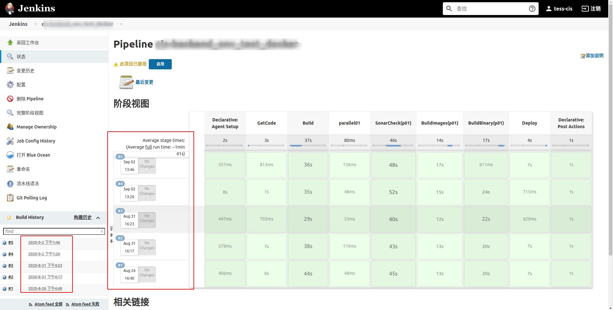

## 1. 简介

### 1-1. 去哪里下载安装包

?> 1-1-1. 从[jenkins中文官网](https://www.jenkins.io/zh/download/)下载安装包（推荐）

- 优点：
    - jenkins官方版本
    - 干净，无添加剂
    - 更新及时

- 缺点：
    - 插件更新源是国外的，即使使用国内源*（也是从国外拉包）*也不快
    - 自定义程度高，要求使用者有较强的解决问题*（插件安装、中文、时区等）*的能力

?> 1-1-2. [jenkins中国定制版](https://hub.docker.com/r/jenkinszh/jenkins-zh)，中国jenkins社区维护的docker镜像

- 优点：
    - 插件更新源是国内定制版本（从清华源获取更新），速度更快
    - 社区"帮忙"安装了一些插件(如中文)

- 缺点:
    - 更新滞后于官方，尤其是更新源
    - 更新源的稳定性有待验证

?> 1-1-3. 示例图

- 官方download页面如下：


### 1.2. 选择哪种版本

下面是一个jenkins 官方版本 docker安装的示例

?> 1-2-1. 选择LTS版本最高的那个


?> 1-2-2. jenkins docker hub 地址


!> 1-2-3. 镜像tag要选择特定版本，不要使用latest lts等tag


## 2. 实践
### 2-1. 使用docker-compose部署jenkins

?> 2-1-1. docker-compose.yml 代码如下

```
version: '3'
services:
    jenkins:
        image: "jenkins/jenkins:2.249.3-lts-centos7"
        container_name: "jenkins-master"
        restart: always
        user: root
        volumes:
            - ./jenkins_home:/var/jenkins_home
            - /run/docker.sock:/run/docker.sock
        ports:
            - 8080:8080
        networks:
           extnetwork:
networks:
   extnetwork:
      ipam:
         config:
         - subnet: 192.168.168.0/24

```
?> 2-1-2. docker-compose常用命令

```bash
## 启动服务

docker-compose up -d 

## 停止服务

docker-compose down

## 拉取镜像

docker-compose pull
```

### 2-2. 对原始镜像进行修改（提高）

通常需要在官方镜像上做一些更改：

?> 如更改时区，语言支持中文等

Dockerfile示例如下：

```bash
FROM jenkins/jenkins:2.249.3-lts-centos7

# 使用root账号而不是默认的jenkins账号启动jenkins
USER root

# 让镜像支持中文，如果不这么做,如邮件，中文日志等位置可能会有乱码
RUN yum install kde-l10n-Chinese -y \
    && yum -y install glibc-common \
    && localedef -c -f UTF-8 -i zh_CN zh_CN.UTF-8 \
    && echo 'LANG="zh_CN.UTF-8"' > /etc/locale.conf \
    && source /etc/locale.conf \
    && yum clean all 
ENV LANG=zh_CN.UTF-8 \
    LC_ALL=zh_CN.UTF-8

# 修改时区，让时间显示正确
COPY ./timezone /etc/timezone
RUN ln -sf /usr/share/zoneinfo/Asia/Shanghai /etc/localtime
```

