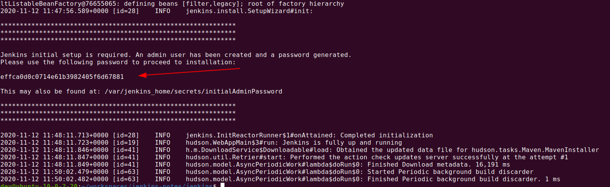
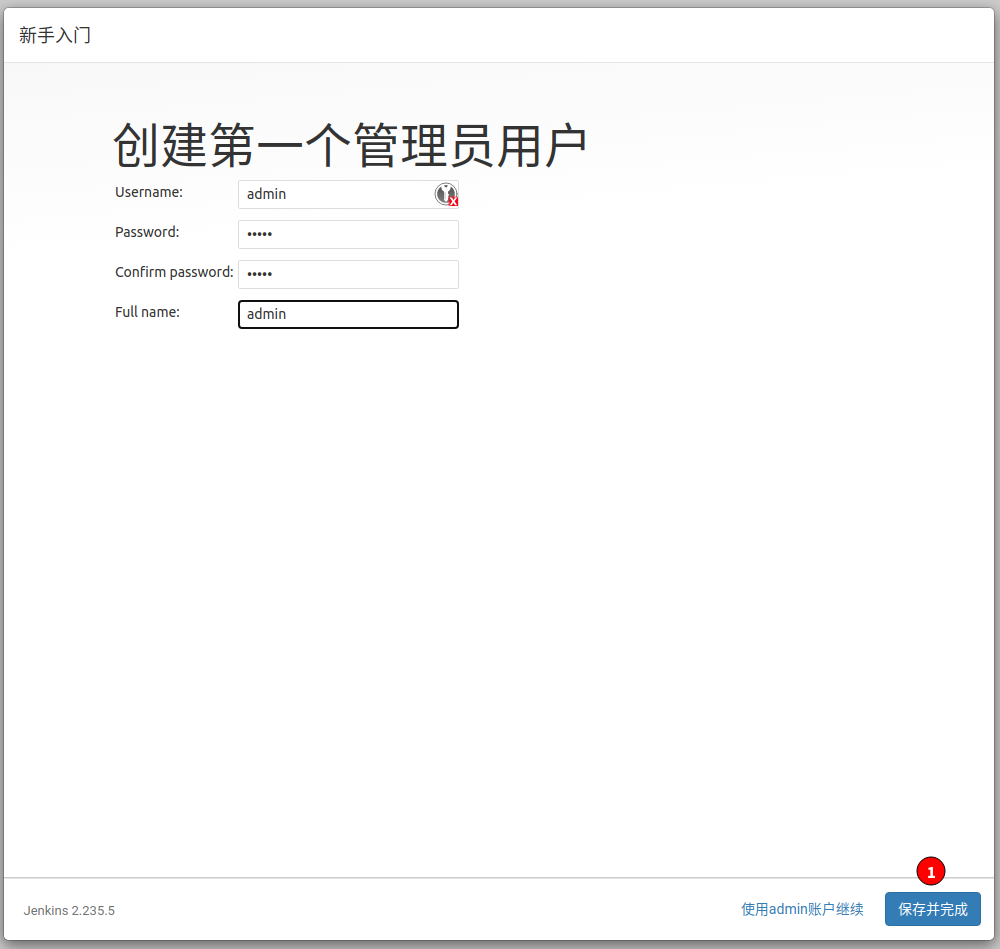
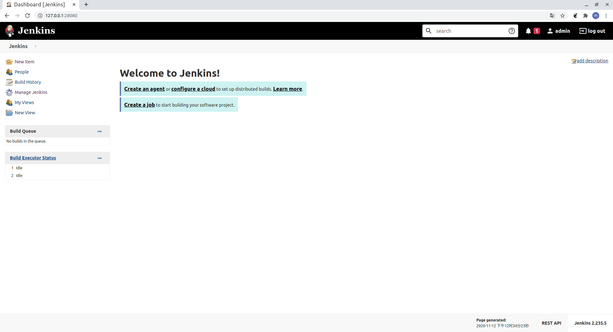
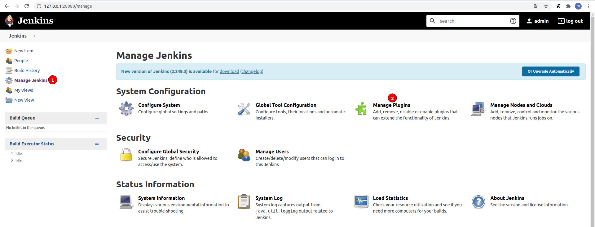

## 1. 准备工作

### 1-1. 安装centos 7.8 64bit(最小化安装)

?>基础软件

```
yum install git wget curl net-tools unzip sudo bind  bind-utils htop -y
```

?>关闭防火墙

```
systemctl stop firewalld
systemctl disable firewalld
```

?> 关闭selinux

```
sed -i 's/SELINUX=enforcing/SELINUX=disabled/' /etc/selinux/config
setenforce 0
```


### 1-2. 安装docker

?> 卸载旧版本docker（可选）

```
sudo yum remove docker \
                  docker-client \
                  docker-client-latest \
                  docker-common \
                  docker-latest \
                  docker-latest-logrotate \
                  docker-logrotate \
                  docker-engine
```

?>安装yum工具

```
sudo yum install -y yum-utils 
```

?>配置docker repo

```
sudo yum-config-manager     --add-repo     https://download.docker.com/linux/centos/docker-ce.repo
```

?>安装docker

```
sudo yum install docker-ce docker-ce-cli containerd.io -y
```

?>检查、启动、设置重启机器启动

```
systemctl start docker.service

systemctl enable docker.service

docker version

```


### 1-3. 安装docker-compose

?>下载docker-compose

```
sudo curl -L "https://github.com/docker/compose/releases/download/1.27.4/docker-compose-$(uname -s)-$(uname -m)" -o /usr/local/bin/docker-compose
```

?>添加执行权限

```
sudo chmod +x /usr/local/bin/docker-compose
```

?>查看版本

```
docker-compose -v
```

## 2. 部署和启动

### 2-1. 获取jenkins部署的repo

!> 本例安装版本： jenkins国内版2.235.5,如果想安装其他版本，请参考[jenkins-compose](https://github.com/msupers/jenkins-compose/)并change下面wget地址


```
sudo mkdir -p /home/workspaces

cd /home/workspaces

wget https://github.com/msupers/jenkins-compose/archive/2.235.5.zip

unzip 2.235.5.zip 

cd jenkins-compose-2.235.5


```

### 2-2. 了解docker-compose.yml含义（可选）

```
version: '3'
services:
    jenkins:
        # docker 镜像，从docker hub 网站获取 lts代表是长期支持版本
        image: "jenkinszh/jenkins-zh:2.235.5"
        # 容器名字前缀，注意有多个docker-compose服务时候不要重复
        container_name: "jenkins-master"
        # 机器重启时，拉起容器
        restart: always
        # 容器里启动服务的命令使用root账号
        user: root
        # jenkins容器的数据持久化到docker-compose.yml 所在文件夹
        volumes:
            - ./jenkins_home:/var/jenkins_home
            # 让容器里可以调用主机的docker
            - /run/docker.sock:/run/docker.sock
        ports:
            # 通过主机的8080端口访问到容器里的8080服务
            - 8080:8080
        networks:
           extnetwork:
# 容器内部ip启动一个私网
networks:
   extnetwork:
      ipam:
         config:
         - subnet: 192.168.168.0/24
```

### 2-3-1. 启动jenkins容器

```
docker-compose up -d 
```

### 2-3-2. 停止jenkins容器

!> 后期维护命令

```
docker-compose down
```

### 2-4. 确认容器状态

```
docker ps 
```


### 2-5. 获取初始化密码

```
docker logs  
```




<!--  -->

## 3. 初始化Jenkins

### 3-1. 浏览器上登陆jenkins

浏览器输入 http://YOUR-HOST-IP:8080

### 3-2. 输入默认密码


### 3-3. 初始化插件


!> 暂时不选择插件,待更新源配置好后统一安装


### 3-4. 创建管理员账户



### 3-5. 检查URL(一般不需要更改)


### 3-6. 完成初始化



## 4. 配置更新源

### 4-1. 配置update源

使用[jenkins-cn](https://cdn.jsdelivr.net/gh/jenkins-zh/update-center-mirror/)的更新源，因为此源是从**国内**拉取插件

!> 配置的update.json要和部署的jenkins版本一致

因为docker-compose.yml中镜像为jenkinszh/jenkins-zh:2.235.5

因此采用更新源： https://updates.jenkins-zh.cn/update-center.json




## 5. 安装插件

?> 插件根据需要安装就好... 具体插件的使用根据使用baidu

### 5-1. 安装插件列表

!> 下列是我常用的一些插件 插件并不是越多越好，减少插件依赖可以避免很多插件升级和维护的麻烦

- Pipeline 
    - *jenkins 2.x 流水线核心插件*

- Maven 
    - *Maven编译全局工具*

- Gradle  
    - *Gradle编译全局工具*

- Email Extension  
    - *邮件扩展*

- Role-based Authorization Strategy  
    - *用户角色*

- JUnit 
    - *展示JUnit单元测试报告*

- TestNG Results 
    - *导出TestNG的测试报告*

- JaCoCo 
    - *生成测试覆盖率的报告*

- Docker 
    - *利用Docker容器动态创建Jenkins Slave。如果有了Kubernetes/Openshift集群，就不需要这个插件了。直接使用下面的Kubernetes插*

- Kubernetes 
    - *这个插件可以将Jenkins Slave Node动态配置为Kubernetes集群上的pod*

- HTTP Request 
    - *在流水线里调用http请求*

- ThinBackup 
    - *备份Jenkins自定义备份Jenkins Home目录*


### 5-2. 安装插件操作

!> 有的插件需要重启，重启之前确保jenkins没人使用


