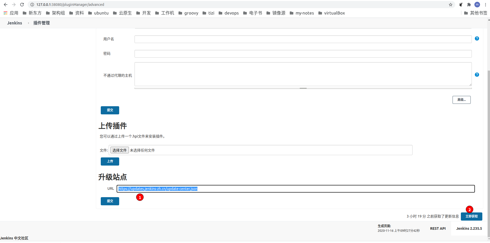

### 4-1. 配置update源

使用[jenkins-cn](https://cdn.jsdelivr.net/gh/jenkins-zh/update-center-mirror/)的更新源，因为此源是从国内拉取插件

!> 配置的update.json要和部署的jenkins版本一致

因为docker-compose.yml中镜像为jenkins/jenkins:2.235.5-lts-centos7

因此采用更新源： https://cdn.jsdelivr.net/gh/jenkins-zh/update-center-mirror@master/tsinghua/stable-2.235/update-center.json

