## 1-0. 环境信息

- ubuntu 20.04
- 非root用户名 dev
- docker
- docker-compose

## 1-1. 获取 docker-compose.yml 文件

```
sudo mkdir /home/dev/workspaces

cd /home/dev/workspaces

sudo git clone https://github.com/msupers/jenkins-notes.git

cd jenkins-notes/jenkins

```

## 1-2. docker-compose.yml 介绍

```
version: '3'
services:
    jenkins:
        # docker 镜像，从docker hub 网站获取 lts代表是长期支持版本
        image: "jenkins/jenkins:2.235.5-lts-centos"
        # 容器名字前缀，注意有多个docker-compose服务时候不要重复
        container_name: "jenkins-master"
        # 机器重启时，拉起容器
        restart: always
        # 容器里启动服务的命令使用root账号
        user: root
        # jenkins容器的数据持久化到docker-compose.yml 所在文件夹
        volumes:
            - ./jenkins_home:/var/jenkins_home
            # 让容器里可以调用主机的docker
            - /run/docker.sock:/run/docker.sock
        ports:
            # 通过主机的8080端口访问到容器里的8080服务
            - 8080:8080
        networks:
           extnetwork:
# 容器内部ip启动一个私网
networks:
   extnetwork:
      ipam:
         config:
         - subnet: 192.168.168.0/24
```

## 1-3. 启动容器并获取初始密码

```
sudo docker-compose up -d 
```

- 检查容器是否正常启动

```
sudo docker ps 
```

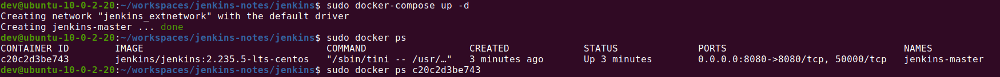

- 查看jenkins密码

```
sudo docker logs  
```

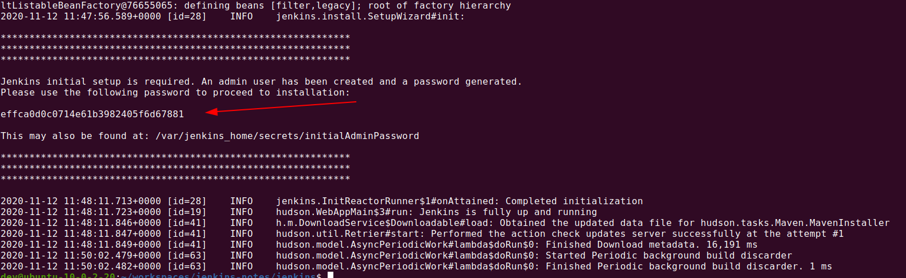

## 1-4. 初步配置

?>输入默认密码

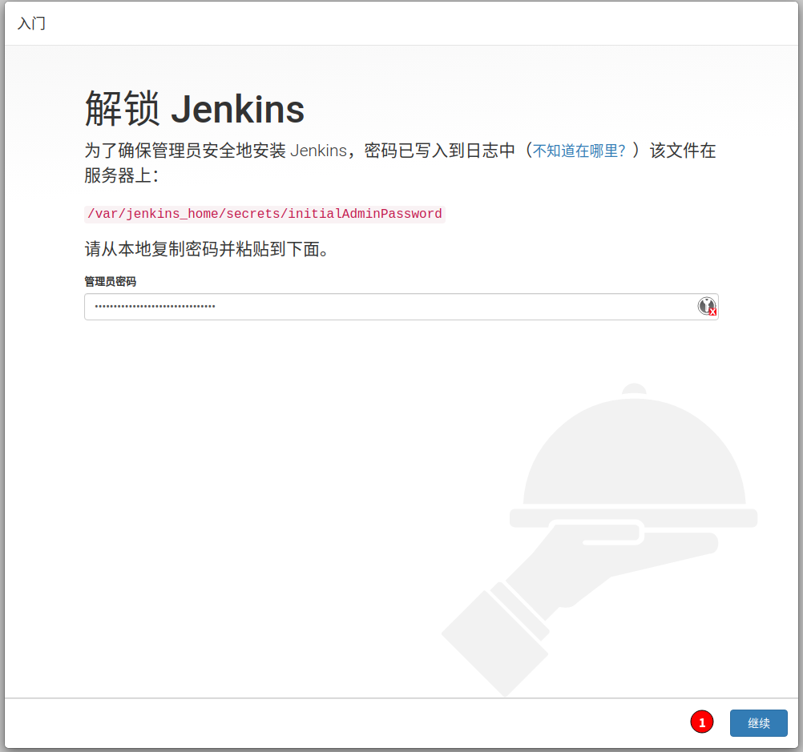

?>自定义插件

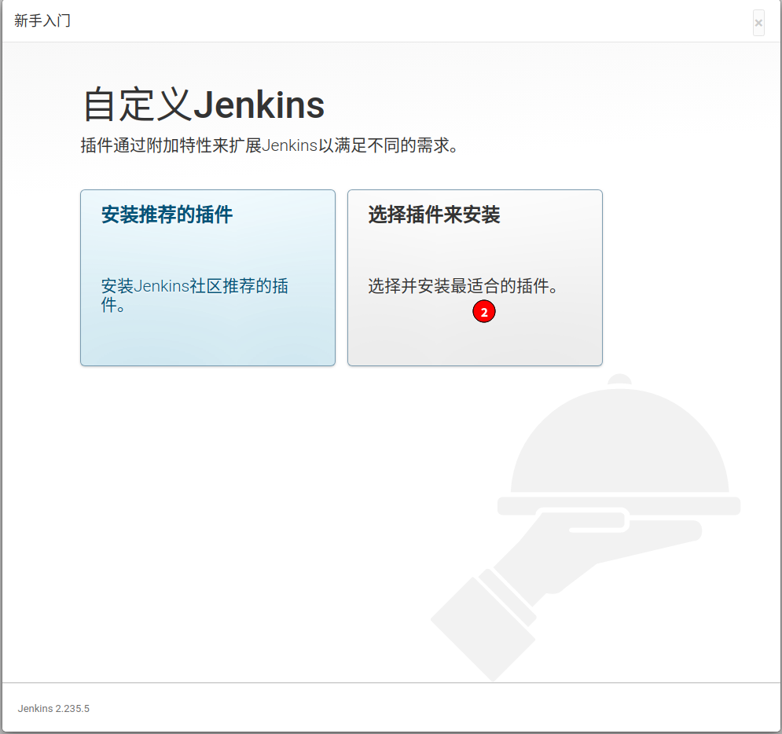

?>暂时不选择插件

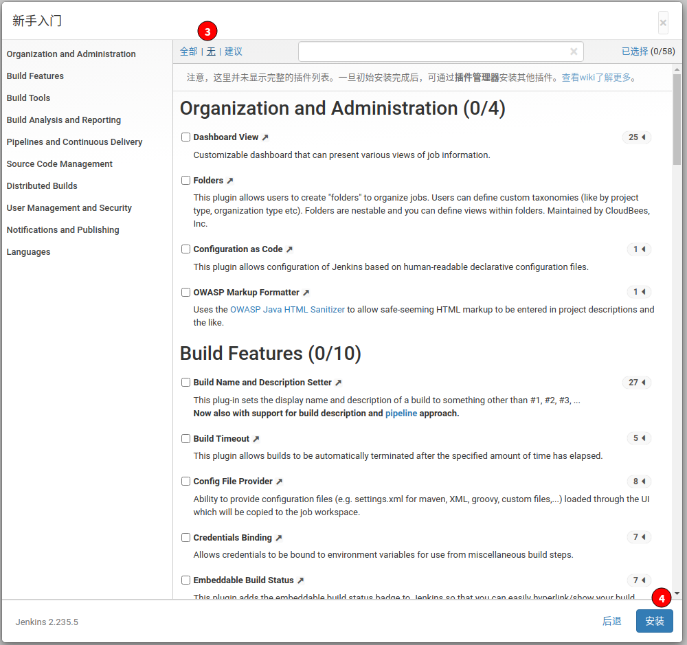

?>创建管理员账户

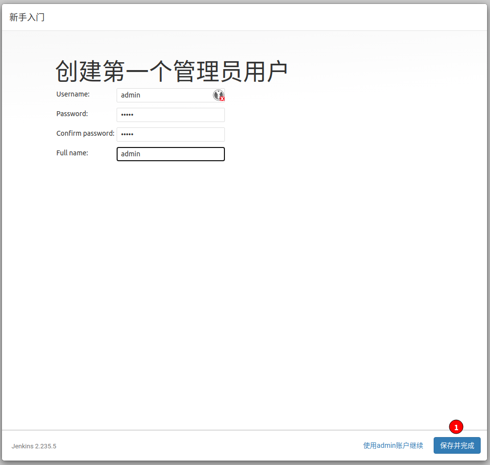

?>实例配置(一般不需要更改)

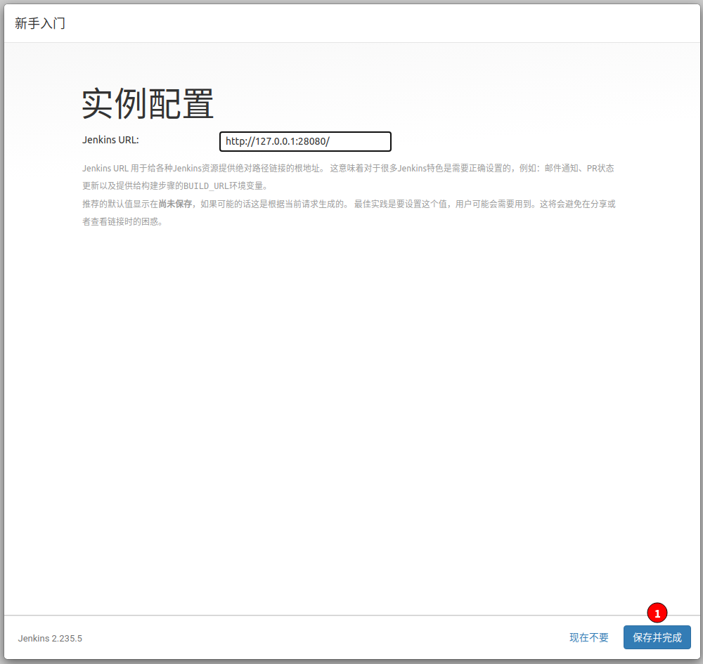

?>预览

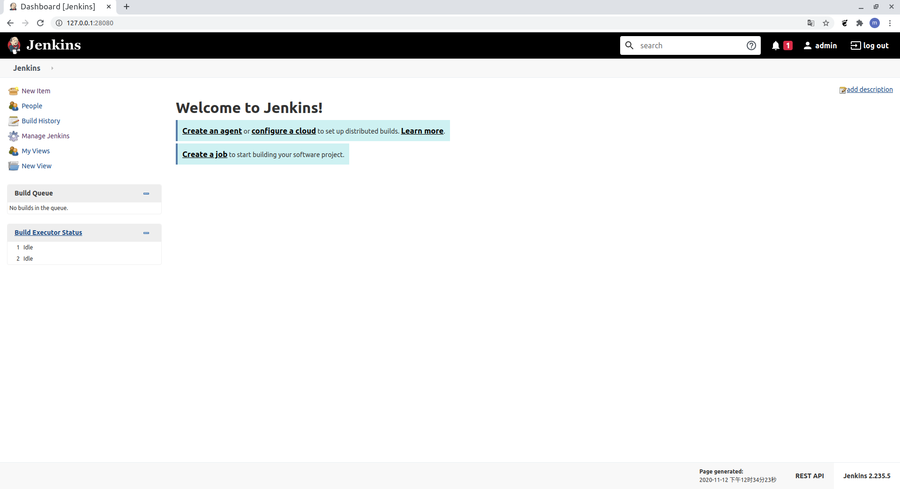

## 1-5. 配置update源

!> 选择使用清华源，确保update版本和安装的版本一致

本示例版本为2.235.5 选择https://mirrors.tuna.tsinghua.edu.cn/jenkins/updates/2.235/update-center.json

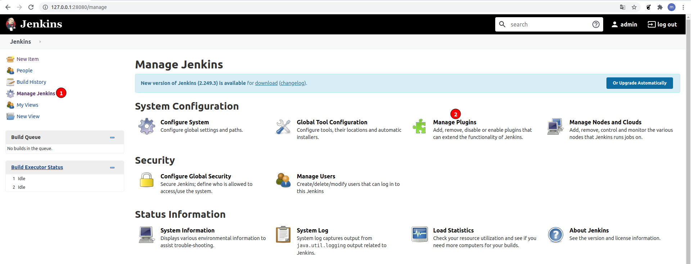

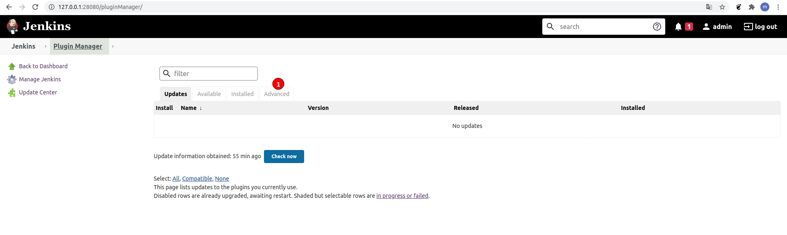

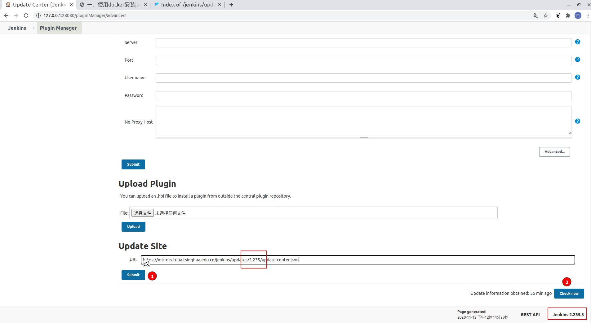


## 1-6. 安装插件

？> 安装pipeline插件


？> 安装其他常用插件

- HTTP Request *jenkins-shared-lib 中发送http请求*
- Chinese (Simplified) *中文*
- Role-based Authorization Strategy *权限认证矩阵*
- AnsiColor *日志支持配置彩色*
- Timestamper *日志打印时间*
- SSH agent *通过SSH连接slave*
- Email Extension *邮件扩展*
- Gradle *全局build 工具*
- NodeJS *全局build 工具*
